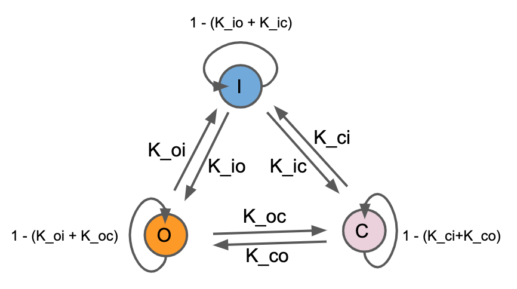
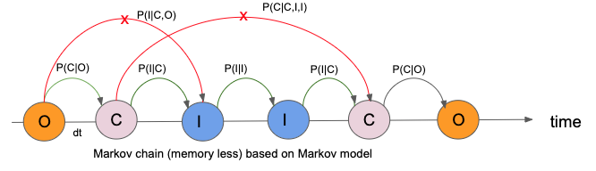

# NCX Channel Modeling 

This online document helps the absolute beginners to persue the future direction in coding and modeling Markov Models for ion channels. The lesson starts with how to write code in Python along with fundamental ideas in data structure, function and class, Numpy. 

        
Following are the major techniques implemented

- **Analytical Solutions** : Manual implementation of condition of equilibrium and detailed balance.
- **Numerical Methods**:
    - **Simultaneous Ordinary Differential Equations**: Solving differential equation by implementation of numerical methods.
    - **Algebraic Method**: Translation of differential equations into an algebraic problem as linear equation of matrices and vector.
- **Monte Carlo Simulation**: Random generation of states based on wighted probability distribution and calculation fraction of states at equilibrium. 
    

   