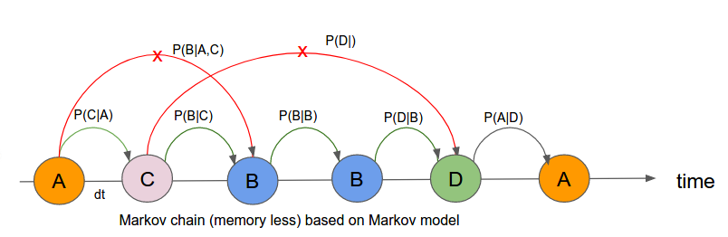

## Four State Markov Model


```python
import numpy as np
import pandas as pd
import matplotlib.pyplot as plt
import seaborn as sns
sns.set()
%matplotlib inline
```

### Model Parameter


```python
k_ab,k_ac,k_ad = 0.53,0.62,0.34
k_ba,k_bc,k_bd = 0.37,0.72,0.44
k_ca,k_cb,k_cd = 0.61,0.76,0.53
k_da,k_db,k_dc = 0.35,0.54,0.66
dt = 0.01
```

### 1. Monte Carlo Simulation

- Monte carlo simulation is a technique to generate samples based on certain distribution. In statistical Mechanics I used this technique to simulate the system of gas ( Idle and real gas) where we used the Blotzman fraction (based on Hamiltonian of the system Exp(E/KT)) for simulation. 

- In our case, for each of the state we have probability distribution vector. For example if the current state is in state “A”. The probability vector is [$K_{aa}*dt, K_{ab}*dt, K_{ac}*dt, K_{ad}*dt$] which represents the probability for state to remain at ‘A’, go to ‘B’,'C' state and go to ‘D’ state respectively.




- How do we do monte carlo simulation? We start with N number of ion channels. For each ion channel we create a Markov chain like  

---A---C---B---B---D---- 

time 0 to T. In this Markov chain, generation of every new state is totally based on current state only. Not on the history of the past states (Red cross X). Due to this property, it is called memoryless chain of states.

- From simulated data, we can calculate the fraction of the states out of N channels. We can calculate this for any instant of time and make a plot to see whether there is equilibrium or not.


```python
M = {"A": [1-(k_ab + k_ac + k_ad)*dt,   k_ab*dt,   k_ac*dt, k_ad*dt],
     "B": [k_ba*dt,  1-(k_ba + k_bc + k_bd)*dt,    k_bc*dt, k_bd*dt],
     "C": [k_ca*dt,  k_cb*dt,   1 - (k_ca + k_cb + k_cd)*dt, k_cd*dt],
     "D": [k_da*dt,  k_db*dt,   k_dc*dt, 1 - (k_da + k_db + k_dc)*dt]}

states = ["A","B","C", "D"]
```


```python
M["A"],M["B"],M["C"],M["D"]
```


    ([0.9851, 0.0053, 0.0062, 0.0034000000000000002],
     [0.0037, 0.9847, 0.0072, 0.0044],
     [0.0061, 0.0076, 0.981, 0.0053],
     [0.0034999999999999996, 0.0054, 0.006600000000000001, 0.9845])


### Simulation


```python
current_state = "A"
T =1000
N =10000

SS = [["A" for n in range (T)] for t in range(N)]

for n in range(N):
    na,nb,nc,nd =0,0,0,0
    for t in range(T):
        new_state = np.random.choice(states, p = M[current_state])
        #print(new_state)
        SS[n][t] = new_state
        current_state = new_state 
```


```python
ss = np.array(SS)
```


```python
Data = []
X = []
for t in range(T):
    X.append(t)
    a = list(ss[:,t]).count("A")/float(N)
    b = list(ss[:,t]).count("B")/float(N)
    c = list(ss[:,t]).count("C")/float(N)
    d = list(ss[:,t]).count("D")/float(N)
    
    Data.append({"A":a,"B":b,"C":c, "D":d})
```

### Data Frame


```python
DF = pd.DataFrame(Data)
DF.head()
```


<div>
<style scoped>
    .dataframe tbody tr th:only-of-type {
        vertical-align: middle;
    }

    .dataframe tbody tr th {
        vertical-align: top;
    }

    .dataframe thead th {
        text-align: right;
    }
</style>
<table border="1" class="dataframe">
  <thead>
    <tr style="text-align: right;">
      <th></th>
      <th>A</th>
      <th>B</th>
      <th>C</th>
      <th>D</th>
    </tr>
  </thead>
  <tbody>
    <tr>
      <th>0</th>
      <td>0.2346</td>
      <td>0.2863</td>
      <td>0.2580</td>
      <td>0.2211</td>
    </tr>
    <tr>
      <th>1</th>
      <td>0.2351</td>
      <td>0.2874</td>
      <td>0.2580</td>
      <td>0.2195</td>
    </tr>
    <tr>
      <th>2</th>
      <td>0.2344</td>
      <td>0.2884</td>
      <td>0.2556</td>
      <td>0.2216</td>
    </tr>
    <tr>
      <th>3</th>
      <td>0.2339</td>
      <td>0.2882</td>
      <td>0.2565</td>
      <td>0.2214</td>
    </tr>
    <tr>
      <th>4</th>
      <td>0.2341</td>
      <td>0.2882</td>
      <td>0.2562</td>
      <td>0.2215</td>
    </tr>
  </tbody>
</table>
</div>


```python
DF.plot(figsize = [12,8])   
```


    <matplotlib.axes._subplots.AxesSubplot at 0x1a1bf340b8>


```python
A = 0.23021616
B = 0.28749159
C = 0.26095346
D = 0.22999999999999998
```

### 2. Analytical Solution

$\large{A = \frac{1}{1 + \frac{k_{ab}}{k_{ba}}  + \frac{k_{ac}}{k_{ca}} + \frac{k_{ad}}{k_{da}} }}$


```python
 1/(1+(k_ab/k_ba)+(k_ac/k_ca) + (k_ad/k_da))
```


    0.22623132041537555


-------

$\large{B = \frac{\frac{k_{ab}}{k_{ba}}}{1 + \frac{k_{ab}}{k_{ba}}  + \frac{k_{ac}}{k_{ca}} + \frac{k_{ad}}{k_{da}} }}$


```python
 (k_ab/k_ba)/(1+(k_ab/k_ba)+(k_ac/k_ca) + (k_ad/k_da))
```


    0.3240610805949974


--------

$\large{C = \frac{\frac{k_{ac}}{k_{ca}}}{1 + \frac{k_{ab}}{k_{ba}}  + \frac{k_{ac}}{k_{ca}} + \frac{k_{ad}}{k_{da}} }}$


```python
 (k_ac/k_ca)/(1+(k_ab/k_ba)+(k_ac/k_ca) + (k_ad/k_da))
```


    0.22994003058611942


------------

$\large{D = \frac{\frac{k_{ad}}{k_{da}}}{1 + \frac{k_{ab}}{k_{ba}}  + \frac{k_{ac}}{k_{ca}} + \frac{k_{ad}}{k_{da}} }}$


```python
(k_ad/k_da)/(1+(k_ab/k_ba)+(k_ac/k_ca) + (k_ad/k_da))
```


    0.2197675684035077


### Linear Algebra Approach


```python
B = np.array([[(k_ab + k_ac + k_ad + k_da),   (k_da - k_ba), (k_da -k_ca)],
              [(k_db - k_ab),   (k_ba + k_bc + k_bd + k_db), (k_db - k_cb)],
              [(k_dc - k_ac),   (k_dc - k_bc), (k_ca + k_cb + k_cd + k_dc)]])

b = np.array([k_da,k_db,k_dc])
```


```python
Binv = np.linalg.inv(B)
```


```python
np.dot(Binv,b), 1- 0.23 - 0.28 - 0.26
```


    (array([0.23021616, 0.28749159, 0.26095346]), 0.22999999999999998)


