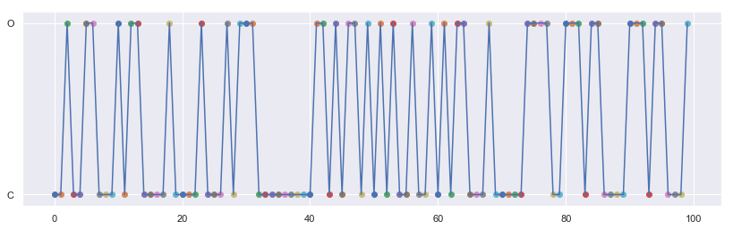

## Random States


```python
import random as random
import numpy as np
import matplotlib.pyplot as plt
import seaborn as sns
sns.set()
%matplotlib inline
```

### Choosing random states 

We can apply python library called 'random' to choose random states out of provided states like 'O' and 'C'.


```python
allstate=[]
for i in range(10000):
    allstate.append(random.choice(["O","C"]))
    #print(s)
```


```python
len(allstate)
```


    10000


```python
allstate.count("O")
```


    4960


```python
allstate.count("C")
```


    5040


This shows that randomly choosed states out of 2 states are 50-50 % in distribution

-------------------

### Choosing Random states with weighted probability

We can choose random states with weighted probability


```python
np.random.choice(["O","c"],p=[0.9,0.1])
```


    'O'


```python
allstate=[]
for i in range(10000):
    allstate.append(np.random.choice(["O","C"],p=[0.9,0.1]))

```


```python
len(allstate)
```


    10000


```python
allstate.count("C")
```


    1017


```python
allstate.count("O")
```


    8983


### Plot a Markov Chain


```python
allstate=[]
for i in range(100):
    allstate.append(np.random.choice(["O","C"],p=[0.4,0.6]))
```


```python
plt.figure(figsize=[14,4])
X = []
Y = []
for x,y in enumerate(allstate):
    plt.scatter(x,y)
    X.append(x)
    Y.append(y)
    
plt.plot(X,Y)
plt.show()  
```




