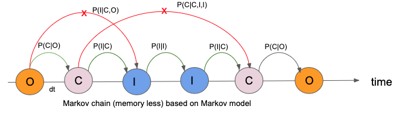
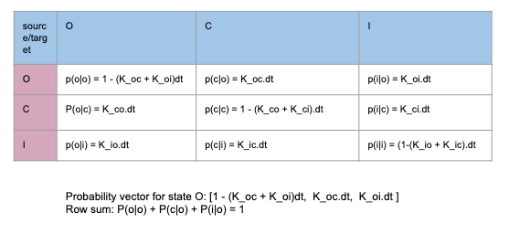

## Three States Markov Model


```python
import numpy as np
import pandas as pd
import matplotlib.pyplot as plt
import seaborn as sns
sns.set()
%matplotlib inline
```

Consider a 3 state Markov model as shown in the figure below.


### Master Equation of Three State Model

- C ,O, I: fraction of states in closed, open and inactive state
- /( K_{ci} /) =  rate of transition from state C to state I and so on

**Condition of Equilibrium**: Influx is equal to outflux

$$K_{co}.C =  K_{oc}.O$$
$$K_{oi}.O  =  K_{io}.I$$
$$K_{ic}.I    =  K_{ci}.C$$

The **condition of detailed balance** : 
$$K_{co}.K_{oi}.K_{ic} = K_{oc}.K_{io}.K_{ci}$$

I.e. The total transitions in clockwise direction is equal to total transitions in counter clockwise direction


Central task: Can we derive the fraction of states at equilibrium?

Answer: Yes, but for large degrees of freedom (states), it is tedious. We need 

- method of simulation or 
- numerical methods: 
    - Simultaneous differential equations 
    - Algebric Methods


For equilibrium condition, we get

$$k_{co} c = k_{oc} o => c = \frac{k_{oc}}{k_{co}}o$$

$$k_{oi} o = k_{io} i => i = \frac{k_{oi}}{k_{io}}o$$

$$k_{ic} i = k_{ci} c$$

$$ o + c + i = 1$$

### Analytical Solution

- Identifying equilibrium condition and calculation of the fraction of states is important for calculation of 
  - ion concentration inside and outside of the membrane (for example outward sodium current or inward calcium current).
  - Potential gradient between in and out of the membrane etc.
  
- An ion channel can be any state at any time. The rate constants like (K_ab) which represents the rate of transition from state A to B. Channel may take fraction of time to go from one state to another. In that situation the rate constant is modified by K*dt (for example in Monte Carlo simulation)

- **Why do we need condition of equilibrium?** The real biological system is assumed to be equilibrium at a given environment. For a specific protocol, we can calculate the rate constants from experiments and design the models based on those rate constants and available states (Open, Closed, Inactive etc). Model give us further insights to understand the dynamics of the system. Statistical calculations like finding fraction of states at a given time or any other average values are possible only when there is an equilibrium.

- **How do we know whether it is equilibrium or not?** In fact, at equilibrium there is constant flow from one state to another state. It feels like there is no extra accumulation over a specific state. This is represented by equations like /( N*K_{co}*C = N*K_{oc}*O /). I.e. Consider N ion Channels, the population transitioning from C state to O is equal to the population transitioning from O to C state.

- Implementing three different conditions of equilibrium, one can derive the single equation called the “principle of detailed balance”. Which means the flow of states in a clockwise direction is equal to the flow in anticlockwise direction.

- Using the above conditions, we can easily derive the fraction of states in terms of rate constants. It is not practical to find analytical solution like this in case of large no of states. Some Computational technique is required. 

- For system which can be brought to the equilibrium condition, there exist different ways to solve : MonteCarlo Simulation, Numerical Methods ( Simultaneous differential equations, Algebraic methods). We can also study the system not in equilibrium where simultaneous differential equation method can be used but it leads to chaotic system for example arrhythmia, long QT syndrome etc. 


```python
k_oi,k_oc = 0.5,0.9
k_io,k_ic = 0.3,0.72
k_co,k_ci = 0.6,0.8
dt = 0.01
```

$$\large{O = \frac{1}{1 + \frac{k_{oc}}{k_{co}} + \frac{k_{oi}}{k_{io}}}}$$


```python
 1/(1+(k_oc/k_co)+(k_oi/k_io))
```


    0.24


$$\large{C = \frac{\frac{k_{oc}}{k_{co}}}{1 + \frac{k_{oc}}{k_{co}} + \frac{k_{oi}}{k_{io}}}}$$


```python
 (k_oc/k_co)/(1+(k_oc/k_co)+(k_oi/k_io))
```


    0.36


$$\large{I = \frac{\frac{k_{oi}}{k_{io}}}{1 + \frac{k_{oc}}{k_{co}} + \frac{k_{oi}}{k_{io}}}}$$


```python
 (k_oi/k_io)/(1+(k_oc/k_co)+(k_oi/k_io))
```


    0.39999999999999997


### Monte Carlo Simulation

Monte carlo simulation is a technique to generate samples based on certain distribution. In statistical Mechanics we use this technique to simulate the system of gas ( idle and real gas) where we used the Blotzman fraction (based on Hamiltonian of the system $(\exp(E/KT)$) for simulation. 

In our case, for each of the state we have probability distribution vector. For example if the current state is in state “O”. The probability vector is /([K_{oo}*dt, K_{oc}*dt, K_{oi}*dt/)$ which represents the probability for state to remain at ‘O’, go to ‘C’ state and go to ‘I’ state respectively.

**How do we do monte carlo simulation?**
- We start with N number of ion channels. 
- For each ion channel we create a Markov chain like  ---O---C---I---i---O---- time 0 to T. In this Markov chain, generation of every new state is totally based on current state only. Not on the history of the past states (Red cross X). Due to this property, it is called memoryless chain of states.
- From simulated data, we can calculate the fraction of the states out of N channels. We can calculate this for any instant of time and make a plot to see whether there is equilibrium or not.


**Central task**: Can we derive the fraction of states at equilibrium?
Yes, following are the steps:
- Start with N random ion channels 
- For each channel, generate a new state based on conditional probability.
- At given point of time calculate the fraction of each state out of total population N along with statistical error and plot the result over time
- Find out the equilibrium and mean fluctuation (standard deviation). Clue: By increasing total population (N), fluctuation can be reduced




- The biggest idea behind why method of simulation is valid for a system like muli-state ion channel is “Principle of ergodicity”. Which means observation of a single ion channel for a very long time (T -> infty) is equivalent to the observation of large number of  ion channels (N-> infty) at a specific time.
- The first table is a collection of rate constant. Where as the second table is for comparison of analytical solution and expectation values from simulation. There is a certain error due to sampling through simulation where data appears to be fluctuation around the mean value equal to analytical value. One can represent the expectation value using standard error.

The associated conditional probabilities can be arranged to represent weighted probability vector for each state




**Challenge**: What is the guarantee that we will reach to the system at equilibrium starting from random initial state?

**The clue is Ergodicity**: the time average of the system(T $\rightarrow \infty$) equal to the ensemble average ($N \rightarrow \infty$)


#### Weighted Probability Vector

We can arrange the conditional probability to create a weighted probability vactor for Monte Carlo Simulation

$$P(O) = [1-(k_oc + k_oi)d\tau,   k_oc d\tau,   k_oi d\tau]$$

$$P(C) = [k_co d\tau,  1-(k_co + k_ci) d\tau,    k_ci d\tau]$$

$$P(I) = [k_io d\tau,  k_ic d\tau,   1 - (k_io + k_ic) d\tau]$$


```python
M = {"O": [1-(k_oc + k_oi)*dt,   k_oc*dt,   k_oi*dt],
     "C": [k_co*dt,  1-(k_co + k_ci)*dt,    k_ci*dt],
     "I": [k_io*dt,  k_ic*dt,   1 - (k_io + k_ic)*dt]}

states = ["O","C","I"]
```


```python
M["O"],M["C"],M["I"]
```


    ([0.986, 0.009000000000000001, 0.005],
     [0.006, 0.986, 0.008],
     [0.003, 0.0072, 0.9898])


### Simulation


```python
current_state = "O"
T =100
N =10000

SS = [["O" for n in range (T)] for t in range(N)]

for n in range(N):
    no,nc,ni =0,0,0
    for t in range(T):
        new_state = np.random.choice(states, p = M[current_state])
        #print(new_state)
        SS[n][t] = new_state
        current_state = new_state 
```

#### Counting and Ensamble everage of states


```python
ss = np.array(SS)
```


```python
Data = []
X = []
for t in range(T):
    X.append(t)
    o = list(ss[:,t]).count("O")/float(N)
    c = list(ss[:,t]).count("C")/float(N)
    i = list(ss[:,t]).count("I")/float(N)
    Data.append({"O":o,"C":c,"I":i})
```

#### Data Frame


```python
DF = pd.DataFrame(Data)
DF.head()
```


<div>
<style scoped>
    .dataframe tbody tr th:only-of-type {
        vertical-align: middle;
    }

    .dataframe tbody tr th {
        vertical-align: top;
    }

    .dataframe thead th {
        text-align: right;
    }
</style>
<table border="1" class="dataframe">
  <thead>
    <tr style="text-align: right;">
      <th></th>
      <th>C</th>
      <th>I</th>
      <th>O</th>
    </tr>
  </thead>
  <tbody>
    <tr>
      <th>0</th>
      <td>0.3690</td>
      <td>0.3933</td>
      <td>0.2377</td>
    </tr>
    <tr>
      <th>1</th>
      <td>0.3688</td>
      <td>0.3925</td>
      <td>0.2387</td>
    </tr>
    <tr>
      <th>2</th>
      <td>0.3700</td>
      <td>0.3921</td>
      <td>0.2379</td>
    </tr>
    <tr>
      <th>3</th>
      <td>0.3718</td>
      <td>0.3906</td>
      <td>0.2376</td>
    </tr>
    <tr>
      <th>4</th>
      <td>0.3706</td>
      <td>0.3907</td>
      <td>0.2387</td>
    </tr>
  </tbody>
</table>
</div>


#### Mean and Standard deviation of states


```python
DF['C'].mean(),DF['C'].std(),
```


    (0.36810600000000016, 0.0020315103601592412)


```python
DF['O'].mean(),DF['O'].std(),
```


    (0.23638799999999993, 0.002197670024219635)


```python
DF['I'].mean(),DF['I'].std(),
```


    (0.3955060000000002, 0.00228507763500057)


### Plot: Equilibrium

The plot represents how fraction of states fluctuate through time 0 to T. The plot shows clear equilibrium as there in no significant change in the values. As we increase the total population of ion channels (N). The error minimizes. Theoretically for N = infinity, the expectation value converges to the analytical value.


```python
# plot results
plt.figure(figsize = [10,4])
plt.plot(X,DF['O'],color ="orange",linewidth=2,label='open')
plt.plot(X,DF['C'],color ="magenta", linewidth=2,label='closed')
plt.plot(X,DF['I'],color = "blue",linewidth=2,label='inactive')
plt.grid(True)
plt.xlabel('Time(t)',fontsize=15)
plt.ylabel('Fraction of states: y(t)',fontsize=15)
plt.title("Plot of fraction of states out of N states",fontsize=15)
plt.legend()
plt.savefig("Sim.png")
plt.show()
```


```python
I = 0.4
C =0.36
O = 0.24
```
