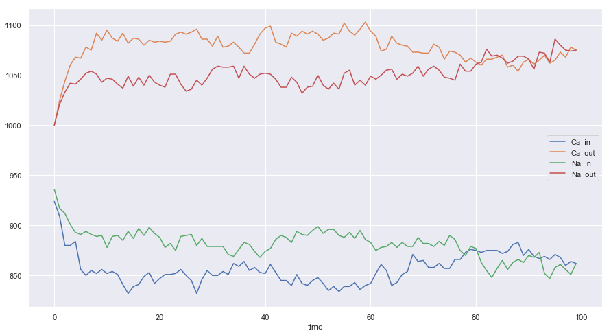
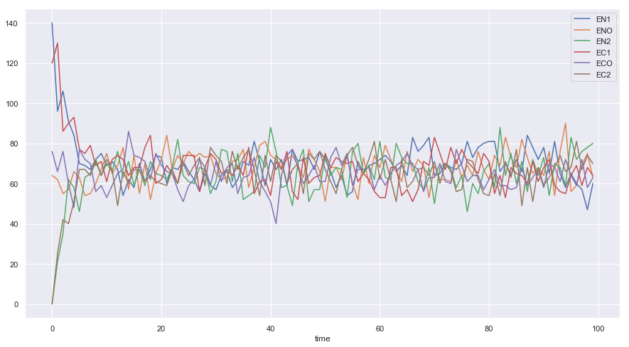
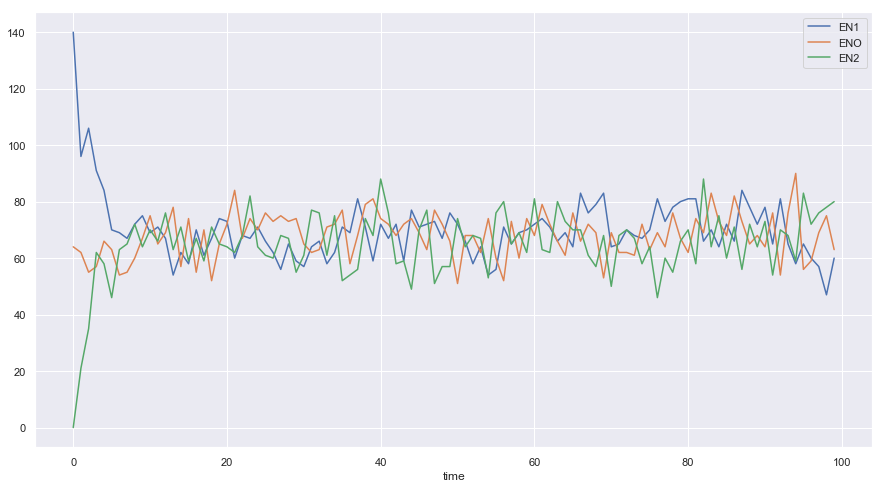
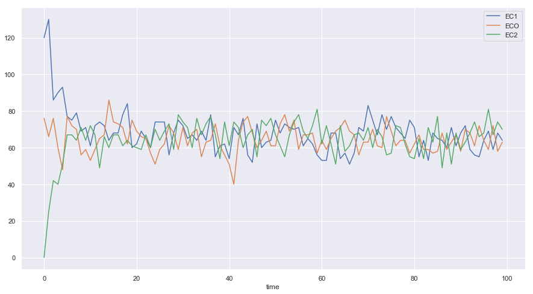

### NCX Simulation Model


```python
import numpy as np
import matplotlib.pyplot as plt
import seaborn as sns
sns.set()
%matplotlib inline
import random as random
import pandas as pd
```

---------------

### Parameters


```python
K_EN1_ENO = 0.33
K_ENO_EN1 = 0.33
K_ENO_EN2 = 0.33
K_EN2_ENO = 0.33

K_EC1_ECO = 0.33
K_ECO_EC1 = 0.33
K_ECO_EC2 = 0.33
K_EC2_ECO = 0.33
```

#### Weighted Probability Vector


```python
M = {"EN1": [1 - K_EN1_ENO,K_EN1_ENO,0,0,0,0],
    "ENO":  [K_ENO_EN1, 1-K_ENO_EN1-K_ENO_EN2,K_ENO_EN2,0,0,0],
    "EN2":  [0, K_EN2_ENO, 1-K_EN2_ENO,0,0,0],
     
     
    "EC1":  [0,0,0,1-K_EC1_ECO,K_EC1_ECO,0],
    "ECO":  [0,0,0,K_ECO_EC1,1-K_ECO_EC1-K_ECO_EC2,K_ECO_EC2],
    "EC2":  [0,0,0,0,K_EC2_ECO,1-K_EC2_ECO]}
```


```python
M
```


    {'EN1': [0.6699999999999999, 0.33, 0, 0, 0, 0],
     'ENO': [0.33, 0.3399999999999999, 0.33, 0, 0, 0],
     'EN2': [0, 0.33, 0.6699999999999999, 0, 0, 0],
     'EC1': [0, 0, 0, 0.6699999999999999, 0.33, 0],
     'ECO': [0, 0, 0, 0.33, 0.3399999999999999, 0.33],
     'EC2': [0, 0, 0, 0, 0.33, 0.6699999999999999]}


```python
class Channel(object):
    '''This class represents a ncx channel'''
    def __init__(self,state,x,y):
        self.x = x
        self.y = y
        self.states = ["EN1","ENO","EN2","EC1","ECO", "EC2"]
        self.state = state
        
    def update(self,M):
        '''Update the state based on markov model'''
        new_state = np.random.choice(self.states, p = M[self.state])
        self.state = new_state
        
    def flip(self):
        if self.state in ["EN1","EC1"]:
            self.state = random.choice(["EN1","EC1"])
        elif self.state in ["EN2","EC2"]:
            self.state = random.choice(["EN2","EC2"])
        
           
```

----------------------


```python
class System(object):
    '''This class represents a 2D lattice system of NCX channels'''
    def __init__(self,Channel,M):
        
        '''lattice dimension'''
        self.Lx = 20
        self.Ly = 20
        
        '''Markov transition matrix'''
        self.M = M
        
        '''A single channel object'''
        self.Channel = Channel
        
        '''concentration of ions'''
        self.nNa_out = 1000
        self.nCa_out = 1000
        self.nNa_in = 1000
        self.nCa_in = 1000
        self.nNa_o = 0
        self.nCa_o = 0
        
        '''concentration of channels'''
        self.nEN1 = 0
        self.nENO = 0
        self.nEN2 = 0
        self.nEC1 = 0
        self.nECO = 0
        self.nEC2 = 0
        
        '''Initiation channel 2D system'''
        self.U = [["o" for i in range(self.Lx)]for j in range(self.Ly)]
        
        self.DATA =[]
        
    def start(self):
        for i in range(self.Lx):
            for j in range(self.Ly):
                
                r_state = random.choice(["EC1","EN1"])
                self.U[i][j] = self.Channel(r_state,i,j)
                
                if r_state == "EN1":
                    self.nEN1 += 1
                if r_state == "ENO":
                    self.nENO += 1
                    self.nNa_o +=3
                if r_state == "EN2":
                    self.nEN2 += 1
                    
                if r_state == "EC1":
                    self.nEC1 += 1
                if r_state == "ECO":
                    self.nECO += 1
                    self.nCa_o += 1
                if r_state == "EC2":
                    self.nEC2 += 1
                
                
                
                
        
    def run(self, verbose = False):
        for i in range(self.Lx):
            for j in range(self.Ly):
                new_state = None 
                old_state = None 
                channel = self.U[i][j]
                old_state = channel.state
                '''generate the next markov state'''
                channel.update(self.M)
                new_state = channel.state
                
                if new_state != old_state:
                    
                    if verbose:
                        print("updated from", old_state, " to ", new_state,\
                          " at ", channel.x, channel.y)
                    
                    
                    '''update the ion concentration'''
                    if new_state == "EN1" and old_state == "ENO":
                            self.nNa_in += 1
                            self.nNa_o -= 1
                            self.nEN1 += 1
                            self.nENO -= 1
                    
                    elif new_state == "ENO" and old_state == "EN1":
                            self.nENO += 1
                            self.nEN1 -= 1
                            self.nNa_o += 1
                            self.nNa_in -= 1
                            
                    elif new_state == "ENO" and old_state =="EN2":
                            self.nENO += 1
                            self.nEN2 -= 1
                            self.nNa_o += 1
                            self.nNa_out -= 1
                        
                    
                    elif new_state == "EN2" and old_state == "ENO":
                            self.nNa_out += 1
                            self.nNa_o -= 1
                            self.nEN2 += 1
                            self.nENO -= 1
                            
                            
                    
                    elif new_state == "EC1" and old_state == "ECO":
                            self.nCa_in += 1
                            self.nCa_o -= 1
                            self.nEC1 += 1
                            self.nECO -= 1
                    
                    elif new_state == "ECO" and old_state == "EC1":
                            self.nECO += 1
                            self.nEC1 -= 1
                            self.nCa_o += 1
                            self.nCa_in -= 1
                            
                    elif new_state == "ECO" and old_state =="EC2":
                            self.nECO += 1
                            self.nEC2 -= 1
                            self.nCa_o += 1
                            self.nCa_out -= 1
                        
                    
                    elif new_state == "EC2" and old_state == "ECO":
                            self.nCa_out += 1
                            self.nCa_o -= 1
                            self.nEC2 += 1
                            self.nECO -= 1
                            
                else:
                    if verbose:
                        print("not updated"," old is ", old_state,\
                          " new is ",new_state,\
                          "at", channel.x, channel.y)
                    
                if channel.state in ["EN1","EN2","EC1","EC2"]:    
                    channel.flip()
                    fliped_state = channel.state
                    if verbose:
                        print("Flipped from ", new_state, " to ", fliped_state)
                
                    if new_state == "EN1":
                        if fliped_state == "EC1":
                            self.nEN1 -= 1
                            self.nEC1 += 1
                    elif new_state == "EN2":
                        if fliped_state == "EC2":
                            self.nEN2 -= 1
                            self.nEC2 += 1
                        
                    elif new_state == "EC1":
                        if fliped_state == "EN1":
                            self.nEC1 -= 1
                            self.nEN1 += 1
                    elif new_state == "EC2":
                        if fliped_state == "EN2":
                            self.nEC2 -= 1
                            self.nEN2 += 1
                        
                
                        
                self.U[i][j] = channel
                
                
                
                
                
    def simulate(self,T):
        self.DATA =[]
        for t in range(T):
            self.run()
            self.DATA.append({"time" : t,\
                              "EN1": self.nEN1,\
                              "ENO": self.nENO,\
                              "EN2": self.nEN2,\
                              "EC1": self.nEC1,\
                              "EC2": self.nEC2,\
                              "ECO": self.nECO,\
                              "Na_out": self.nNa_out,\
                              "Na_in": self.nNa_in,\
                              "Na_occ": self.nNa_o,\
                              "CA_occ": self.nCa_o,\
                              "Ca_in": self.nCa_in,\
                              "Ca_out": self.nCa_out})
                
```

### Simulation


```python
S = System(Channel,M)
S.start()
S.simulate(T=100)
```

### DataFrame


```python
DF = pd.DataFrame(S.DATA)
DF.head(5)
```


<div>
<style scoped>
    .dataframe tbody tr th:only-of-type {
        vertical-align: middle;
    }

    .dataframe tbody tr th {
        vertical-align: top;
    }

    .dataframe thead th {
        text-align: right;
    }
</style>
<table border="1" class="dataframe">
  <thead>
    <tr style="text-align: right;">
      <th></th>
      <th>CA_occ</th>
      <th>Ca_in</th>
      <th>Ca_out</th>
      <th>EC1</th>
      <th>EC2</th>
      <th>ECO</th>
      <th>EN1</th>
      <th>EN2</th>
      <th>ENO</th>
      <th>Na_in</th>
      <th>Na_occ</th>
      <th>Na_out</th>
      <th>time</th>
    </tr>
  </thead>
  <tbody>
    <tr>
      <th>0</th>
      <td>76</td>
      <td>924</td>
      <td>1000</td>
      <td>120</td>
      <td>0</td>
      <td>76</td>
      <td>140</td>
      <td>0</td>
      <td>64</td>
      <td>936</td>
      <td>64</td>
      <td>1000</td>
      <td>0</td>
    </tr>
    <tr>
      <th>1</th>
      <td>66</td>
      <td>909</td>
      <td>1025</td>
      <td>130</td>
      <td>25</td>
      <td>66</td>
      <td>96</td>
      <td>21</td>
      <td>62</td>
      <td>917</td>
      <td>62</td>
      <td>1021</td>
      <td>1</td>
    </tr>
    <tr>
      <th>2</th>
      <td>76</td>
      <td>880</td>
      <td>1044</td>
      <td>86</td>
      <td>42</td>
      <td>76</td>
      <td>106</td>
      <td>35</td>
      <td>55</td>
      <td>912</td>
      <td>55</td>
      <td>1033</td>
      <td>2</td>
    </tr>
    <tr>
      <th>3</th>
      <td>60</td>
      <td>880</td>
      <td>1060</td>
      <td>90</td>
      <td>40</td>
      <td>60</td>
      <td>91</td>
      <td>62</td>
      <td>57</td>
      <td>901</td>
      <td>57</td>
      <td>1042</td>
      <td>3</td>
    </tr>
    <tr>
      <th>4</th>
      <td>48</td>
      <td>884</td>
      <td>1068</td>
      <td>93</td>
      <td>51</td>
      <td>48</td>
      <td>84</td>
      <td>58</td>
      <td>66</td>
      <td>893</td>
      <td>66</td>
      <td>1041</td>
      <td>4</td>
    </tr>
  </tbody>
</table>
</div>


### Results


```python
DF.plot(x = "time", y =["Ca_in","Ca_out","Na_in","Na_out"],figsize = [15,8])
```


    <matplotlib.axes._subplots.AxesSubplot at 0x10b259f60>





```python
DF.plot(x = "time", y =["EN1","ENO","EN2","EC1","ECO","EC2"],figsize = [15,8])
```


    <matplotlib.axes._subplots.AxesSubplot at 0x1a1da2dba8>





```python
DF.plot(x = "time", y =["EN1","ENO","EN2"],figsize = [15,8])
```


    <matplotlib.axes._subplots.AxesSubplot at 0x1a1dd50390>





```python
DF.plot(x = "time", y =["EC1","ECO","EC2"],figsize = [15,8])
```


    <matplotlib.axes._subplots.AxesSubplot at 0x1a1d9a76d8>





#### Markov Chain


```python
C = Channel("EN1",2,2)
print(C.state)
for i in range(10):
    C.update(M)
    print(C.state)
    C.flip()
    print(C.state)
```

    EN1
    ENO
    ENO
    ENO
    ENO
    ENO
    ENO
    EN1
    EC1
    EC1
    EN1
    ENO
    ENO
    EN2
    EC2
    ECO
    ECO
    EC2
    EN2
    EN2
    EC2

